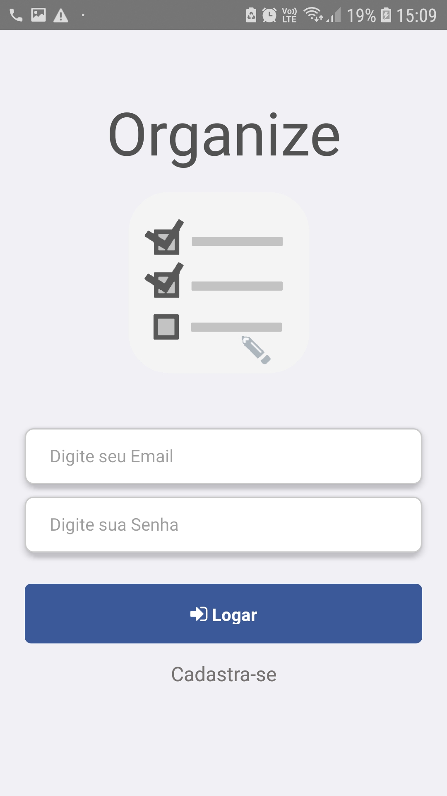

<h1 align="center">
Organize-se
 
</h1>

<h3 align="center">
Projeto de Organização pessoal em formato de Listas
 
</h3>
 

- O que é o site?

  > Aplicativo desenvolvido afim de ajudar na listagem de elementos do dia a dia. Exemplo a listagem itens para compras de supermercado, listagem de atividades a serem feitas, entre outras

- Telas do aplicativo:

  ### :camera: Tela de Login

  

  
  

  ### :camera: Cadastro do Usuário

  

  
  

  ### :camera: Listagem

  

  
  
  

  ### :camera: Detalhes de uma Lista

  

  
  
  

  ## Tecnologias:

  - [x] React Native
  - [x] Firebase(Autenticação, Banco de dados)
